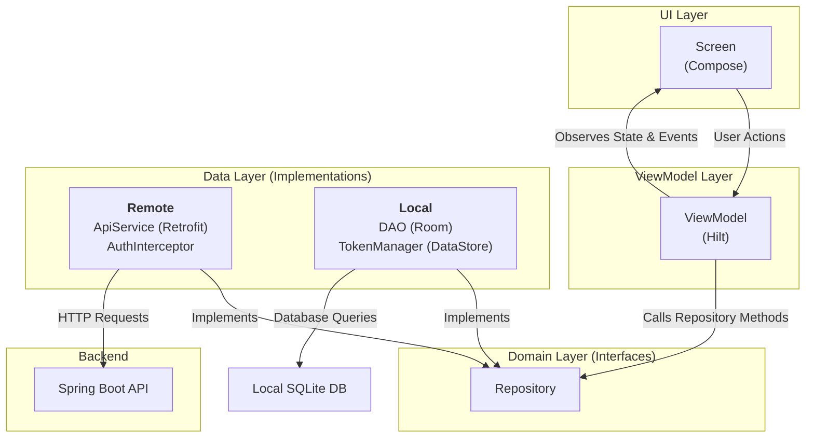
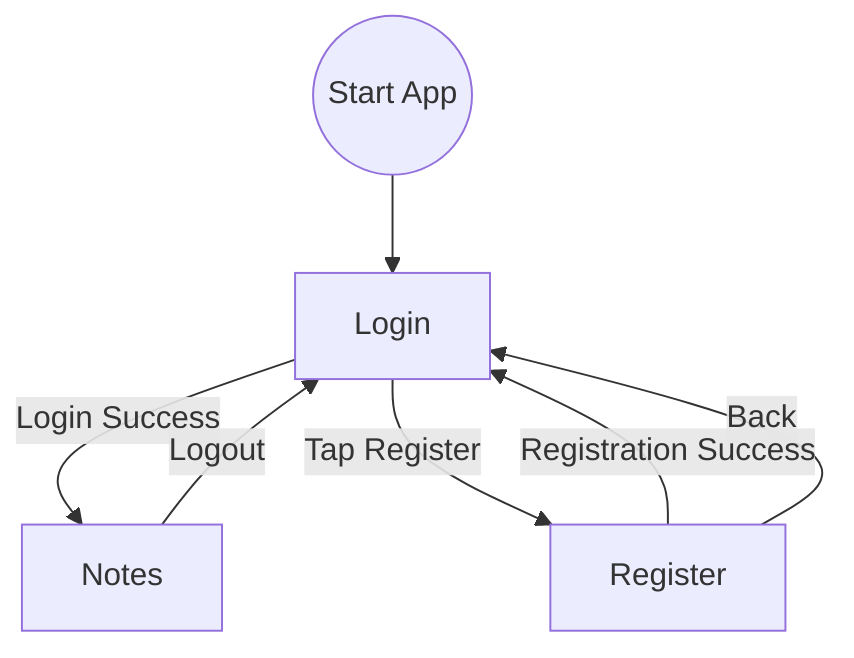

# Android Frontend for AuthProject

This directory contains the complete Android frontend for the Spring Boot authentication and notes application. It is built using modern Android development practices and libraries.

## Tech Stack

*   **UI:** Jetpack Compose for declarative UI development.
*   **Language:** 100% Kotlin
*   **Concurrency:** Kotlin Coroutines and Flow for asynchronous operations.
*   **Architecture:** MVVM (Model-View-ViewModel) with principles from Clean Architecture.
*   **Dependency Injection:** Hilt for managing dependencies.
*   **Networking:** Retrofit for type-safe HTTP requests to the backend API.
*   **Local Storage:**
    *   Room for caching notes data, providing a single source of truth.
    *   Jetpack DataStore for securely persisting authentication tokens.
*   **Navigation:** Jetpack Navigation Compose for handling screen transitions.

## Project Structure

The project follows a clean architecture structure, separating concerns into distinct layers.

```
frontend/app/src/main/java/com/example/authproject/frontend/
├── data/
│   ├── local/
│   │   ├── dao/          # Room Data Access Objects (e.g., NoteDao)
│   │   ├── datastore/    # Jetpack DataStore for token management (TokenManager)
│   │   └── AppDatabase.kt# Room database definition
│   ├── remote/
│   │   ├── api/          # Retrofit API service interfaces (e.g., AuthApiService)
│   │   ├── dto/          # Data Transfer Objects for network responses
│   │   └── AuthInterceptor.kt # Retrofit interceptor to add auth tokens to headers
│   ├── repository/     # Repository implementations (e.g., NoteRepositoryImpl)
│   └── Mappers.kt      # Functions to map DTOs to local models
├── di/                   # Hilt dependency injection modules
│   ├── DatabaseModule.kt
│   ├── NetworkModule.kt
│   └── RepositoryModule.kt
├── domain/
│   ├── model/            # Clean data models for the UI (e.g., Note)
│   └── repository/     # Repository interfaces
├── ui/
│   ├── screens/          # Composable screens and their ViewModels
│   └── theme/            # App theme and styling
└── util/                 # Utility classes (Resource, NetworkBoundResource)
```

## How It Works

The application is built around a "single source of truth" principle. The UI observes data from a local Room database. This database is kept in sync with the remote backend API. This provides a robust offline-first experience.

### Authentication Flow
1.  The user can either log in or register.
2.  On successful authentication, the backend returns an access token and a refresh token.
3.  These tokens are securely stored on the device using Jetpack DataStore.
4.  A Retrofit `Interceptor` (`AuthInterceptor`) automatically attaches the access token to the header of all subsequent authenticated API requests.

### Data Flow (Notes)

The `NoteRepository` uses a `networkBoundResource` utility to manage data fetching.

1.  **Query:** The ViewModel requests notes from the `NoteRepository`. The repository first queries the local Room database for cached notes. This data is immediately displayed to the user.
2.  **Fetch:** Simultaneously, the repository triggers a network request using Retrofit to fetch the latest notes from the backend.
3.  **Save:** Upon receiving a successful response from the network, the new data is saved into the Room database.
4.  **Update UI:** Since the UI is observing a `Flow` from the Room database, it automatically updates to display the fresh data without any further action.

### Control Flow (Navigation)

The app uses a single `Activity` (`MainActivity`) that hosts a `NavHost`. Navigation between screens is handled by the Jetpack Navigation component. The `onLogout` function clears the stored tokens and navigates the user back to the login screen.

## Diagrams

### Data Flow Diagram


### Navigation Flow Diagram
